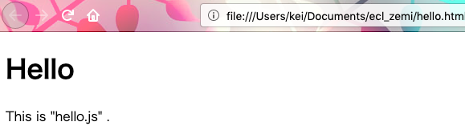
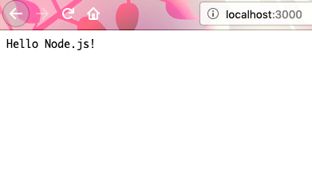

## Node.js 超入門

### ECL 輪読発表
#### 蒔田圭輔


---

## OUTLINE

- ### A-1 値と変数の基本
- ### 2-1 ソースコードの基本
- ### 2-2 HTMLファイルを使おう

---

### A-1 値と変数の基本

JavaScriptとNode.jsの関係
- JavaScript(以下js)は、webブラウザ上で動作するスクリプト言語
- Node.js(以下node)はサーバサイドで動作するjsの環境
　
\* 本節では、jsの基本的な仕様について述べる

+++?code=a1.html

### A-1 値と変数の基本

#### Webブラウザでjsを利用してみよう


+++


ブラウザでの出力画面

+++

### プログラムを書くにあたっって気をつけること

- 文は半角が基本
- 大文字と小文字は別扱い |
- スペースは無視可能 |
- インデントは大切 |
- 文は改行またはセミコロン |
- 補足等はコメントアウト |

+++?code=hello.rb

#### [蛇足] Rubyでは

+++

## jsを書く場所
- htmlに記述する場合
- 別ファイルに記述する場合  

+++?code=a1.html

#### htmlに記述する場合

 < script > </ script >の間に記入する

+++?code=hello.js

#### 別ファイルに記述する場合

+++?code=hello.html

#### scriptタグ内でソースファイルを指定

+++



+++

### いろいろな値
- 数値 'number' 型 |
    - 100, 3.14
- 文字列 'string' 型 |
    - 'Hello', "world"
- 真偽値　'boolean' 型 |
    - true, false
- null型 |
- undefined型 |

#### typeof hoge で型が分かる

+++

### 変数

#### 変数の宣言

``` javascript
var hoge0;

hoge1 = 1;

let hoge2;

const hoge3;
```
- 代入するなら 変数 = 値 |
- 変数の値取得は 代入先 = 変数名 |

+++

### 計算をする
- 加算: +
- 減算: -
- 乗算: *
- 除算: /

+++ ?code=a3.html

+++ ?code=a3.js

+++


+++

### まとめ

- JavaScriptはhtml上で動作するスクリプト言語
- htmlに直書きするか、jsファイルを作成してhtmlで読み込む |
- 値を保存し、管理する"変数"
- 主要なデータ型3つは、number, string, boolean |
- 変数計算をして、その値をhtml上に出力することができる

---

## 2-1 ソースコードの基本

+++

#### 第一回にて実行したソースを分解してみる

``` js
require('http').createServer(
    (rq,rs)=>{rs.end('Hello Node.js!');}).listen(3000);
```

+++?code=2-01.js

#### こんなかんじにできる

+++

### Nodeで実行してみる

``` shell
$ node app.js
```

+++

#### localhost3000番にアクセス



+++

### :3000って?

- ポート番号と言い、サーバへアクセスする上、同一サーバ上でサービスの選択をする事ができる |

### どうして3000番なの?

- nodeでは標準的に3000番を利用するようになっている |

+++?code=2-01.js

@[1](httpモジュールを取得して代入)
@[3](サーバオブジェクトの生成)
@[4,5,6](クライアントからアクセスされたときの動作を無名関数で定義)
@[8](ポート番号3000番によるアクセスを待機)


--- 

## 2-2 HTMLファイルを使おう 


